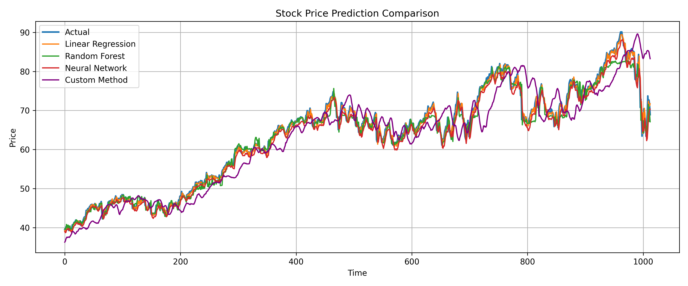

# 📈 Stock Market Price Predictor

A machine learning project that predicts future stock prices using historical stock data from NASDAQ.  
This project was developed for a course project and demonstrates the performance of multiple models on stock price forecasting.

## 🔍 Objective

To predict the next day's closing stock price using machine learning models trained on historical daily data.

## 🗂️ Dataset

- Source: [Kaggle - Stock Market Dataset](https://www.kaggle.com/datasets/jacksoncrow/stock-market-dataset)
- Contains daily prices of NASDAQ stocks in CSV format
- Example used: `AAPL.csv`

## 📊 Models Used

| Model             | Mean Squared Error | R² Score |
|------------------|--------------------|----------|
| Linear Regression | 1.32              | 0.9912    |
| Random Forest     | 3.07              | 0.9795    |
| Neural Network    | 2.83              | 0.9506   |
| Custom Method     | 22.66              | 0.8489   |

### 📈 Output Visualization

## 🧠 Techniques

- Lag-based feature engineering (Close₋₁, Close₋₂, Close₋₃)
- Model comparison using MSE and R²
- Feature scaling for neural network training
- Evaluation using scikit-learn metrics
- Plotting with Matplotlib

## 📁 File Structure

├── data/ 
    │ 
    └── stocks/ 
        │ 
        └── AAPL.csv 
├── plots/ 
    │ 
    └── comparison.png 
├── stock_predictor.ipynb 
├── README.md 
└── report/ (optional)

## 🧑‍💻 Contributor

- Widyan Mohammed Hussien

## ✅ Status

Project completed and submitted as part of course requirements (Due: April 27).
